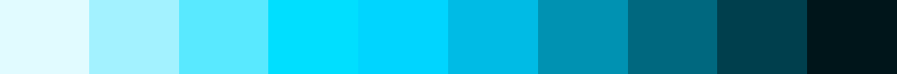
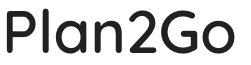
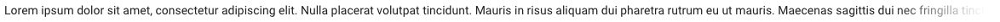
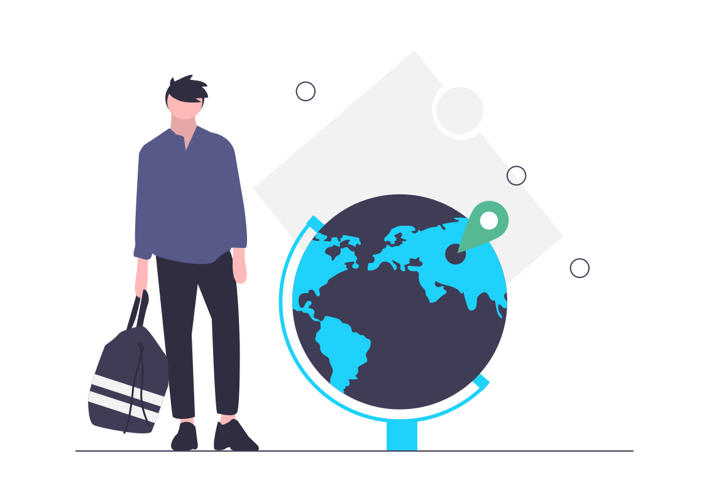

# Plan2Go

## Cores

### Primária

* Base: #1ed2fb - rgb(30, 210, 251)
* Texto acessível: #303030 - rgb(48, 48, 48) - https://webaim.org/resources/contrastchecker/?fcolor=303030&bcolor=1ED2FB
* Variações - https://superdevresources.com/tools/color-shades#c3d91e

### Secundária

* Base: #cfe335 - rgb(207, 227, 53)
* Texto acessível: #303030 - rgb(48, 48, 48) - https://webaim.org/resources/contrastchecker/?fcolor=303030&bcolor=CFE335
* Variações - https://superdevresources.com/tools/color-shades#04b2d9

## Tipografia

### Títulos

* Quicksand
* Peso 600 (seminegrito)
* https://fonts.google.com/specimen/Quicksand?query=quic&preview.text=Plan2Go&preview.text_type=custom&selection.family=Quicksand:wght@600&sidebar.open

### Texto

* Roboto
* Peso 400 (regular)
* https://fonts.google.com/specimen/Roboto?query=roboto&preview.text_type=custom&selection.family=Roboto&sidebar.open

## Ilustrações

Para telas de carregamento, slides, páginas de apresentação...

## Sombras

Tons de cinza, três níveis:
 * 1px 1px 2px rgba(130, 130, 130, 0.2)
 * 1px 2px 5px rgba(130, 130, 130, 0.3)
 * 1px 4px 7px rgba(130, 130, 130, 0.2)

## Bordas

Arredondadas com 6px, sem níveis, sem largura.

